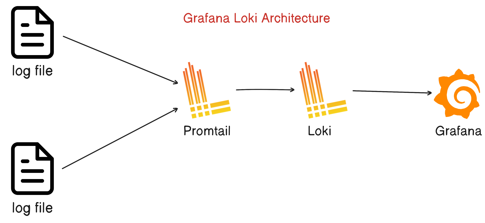
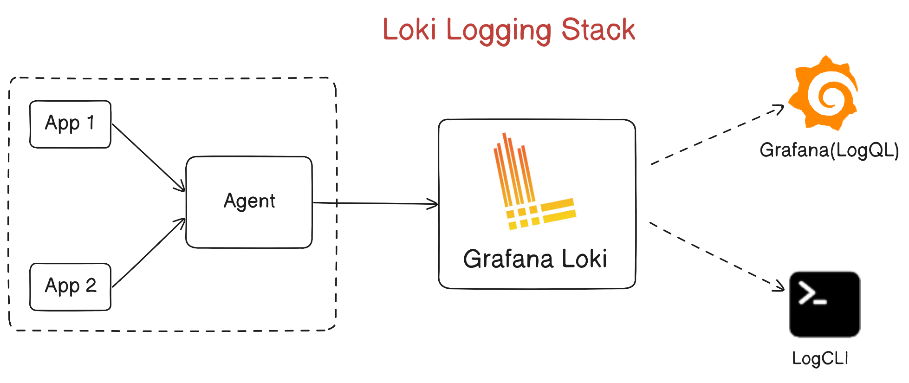

# Day 74: Grafana Loki Concept - Part 01

### Getting Started with Grafana Loki

### What is Grafana Loki?

- **Grafana Loki** is a `horizontally -scalable`,`highly-available`, multi-tenant **log aggregration** system inspired by **Prometheus.** It is designed to be `very cost effective` and `easy to operate`.
- Loki is bult around the idea of only indexing `labels for logs` and leaving the `originals logs messages unindexed`. This means that loki is cheaper to operate and can be order of magnitude more efficient.
- The loki project was started at Grafana labs in 2018. Loki is released under the AGPLv3 license.

### Benefits of Loki:

- Indexing only metadata and not the full logs.
- Cost effective due to require less memory and logs are stored on object stores like S3 or locally.
- **Multi Tenancy:** Supports multi-tenancy by using tenant ID ,so each tenants have their data stored separately.
- **Modes of Operation:** Loki is optimized for both running locally(or at small scale) and for scaling horizontally.

### Why use Grafana Loki?

-  **It’s really easy to get started** because you can send logs in any format, from any source, using a wide array of clients.

-  **100% persistence to object storage** means you get petabyte scale, high throughput and cost-effective & durable storage.

-  **Build metrics and generate alerts** from your log lines.

-  **No ingestion log formatting requirements** gives you more flexibility and the option to format at query time.

-  **Tail your logs in realtime** to see the logs as they come into the system, update the logs after every certain time, view logs for a particular date, etc.

-  **Natively integrates with Prometheus, Grafana and K8s** so you can seamlessly move between metrics, logs and traces within a single UI.

### How does Grafana Loki Works?

- **Pull in any logs with Promtail:** Promtail is a `logs collector` built specifically for Loki. It uses the same service discovery as Prometheus and includes analogous features for labeling, transforming, and filtering logs before ingestion into Loki.

- **Store the logs in Loki:** Loki does not index the `text of logs`. Instead, entries are grouped into **streams and indexed** with labels.Not only does this `reduce costs`, it also means log lines are available to query within milliseconds of being received by `Loki`.

- **Use LogQL to explore:** Use Loki’s powerful query language, **LogQL**, to explore your `logs`. Run LogQL queries directly within Grafana to visualize your logs alongside other data sources, or with LogCLI, for those who prefer a command line experience.

- **Alert on your logs:** Set up `alerting rules` for `Loki to evaluate` on your incoming log data. Configure Loki to send the resulting alerts to a Prometheus Alertmanager so they can then get routed to the right team.

### What is Promtail?

- **Promtail** is an agent which ships the contents of local logs to a private `Grafana Loki instance or Grafana Cloud`. It is usually deployed to every machine that runs applications which need to be monitored.

1. **It primarily:**

- Discovers targets
- Attaches labels to log streams
- Pushes them to the Loki instance.

### Grafana Loki Architecture:

- **ARCHITECTURE EXPLAINATION:**

1. **Data Collection:**

- Applications and services generate log data.
- Promtail, a Loki component, collects log data from these sources.

2. **Log Data Transformation:**

- Promtail adds labels (metadata) to the log entries, making them more organized and searchable.

3. **Data Ingestion into Loki:**

- Promtail sends the labeled log data to Loki's ingestion service.

4. **Log Indexing and Storage:**

- Loki indexes and stores the log entries, making them available for queries.
- Log data is organized efficiently in Loki, ready for retrieval.

5. **Query and Visualization:**

- Users can query the log data using LogQL, Loki's query language.
- Grafana, the observability platform, connects to Loki and fetches log data based on user queries.
- Grafana is used to create dashboards and visualize log data.

#### So in this architecture, Promtail collects logs, adds labels to them, and sends them to Loki for storage. Users can then use Grafana to query and visualize the log data. This setup simplifies log management and enables efficient log analysis in your environment.

---

### Loki Logging Stack Architecture:

- **A typical Loki-based logging stack consists of 3 components:**

- **Agent** - An agent or client, for example Promtail, which is distributed with Loki, or the Grafana Agent. The agent scrapes logs, turns the logs into streams by adding labels, and pushes the streams to Loki through an HTTP API.

- **Loki** - The main server, responsible for ingesting and storing logs and processing queries. It can be deployed in three different configurations, for more information see deployment modes.

- **Grafana** - for querying and displaying log data. You can also query logs from the command line, using LogCLI or using the Loki API directly.

---

### Grafana Overview:

- Grafana Loki is a set of components that can be composed into a fully featured logging stack.
- Unlike other logging systems, Loki is built around the idea of only indexing metadata about your logs: labels (just like Prometheus labels). Log data itself is then compressed and stored in chunks in object stores such as Amazon Simple Storage Service (S3) or Google Cloud Storage (GCS), or even locally on the filesystem.
- A small index and highly compressed chunks simplifies the operation and significantly lowers the cost of Loki.

---

### Stay Tuned for Grafana Loki Hands-On in the Next Part.
